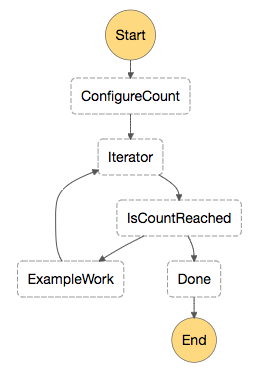
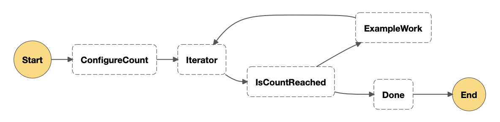
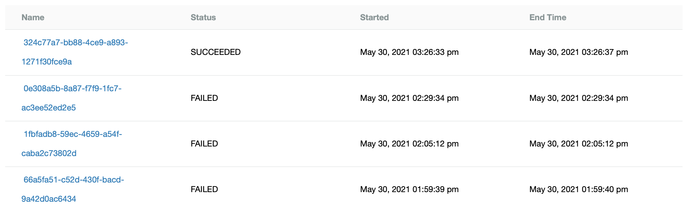
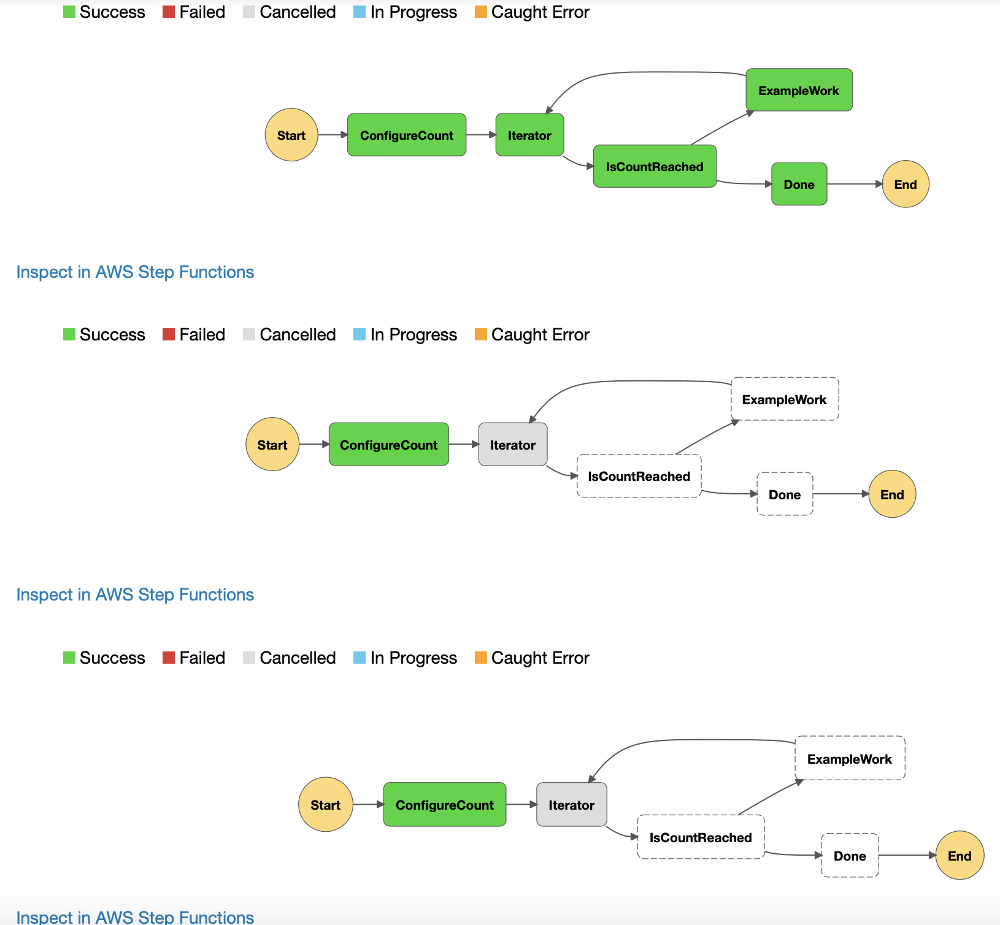

## Intro:

This example has been created from [Iterating a Loop Using Lambda ](https://docs.aws.amazon.com/step-functions/latest/dg/tutorial-create-iterate-pattern-section.html) for more details please check out link. This example will focus on developing the Stepfunctions Statemachine using `R stepfunctions sdk`.

## The Build:

First build the lambda function in [Iterating a Loop Using Lambda ](https://docs.aws.amazon.com/step-functions/latest/dg/tutorial-create-iterate-pattern-section.html) and call it `Iterator`.

lambda function used for workflow:
```js
exports.handler = function iterator (event, context, callback) {
  let index = event.iterator.index
  let step = event.iterator.step
  let count = event.iterator.count
 
  index += step
 
  callback(null, {
    index,
    step,
    count,
    continue: index < count
  })
}
```

Our target state machine is as follows:



## R stepfunctions sdk:

```r
library(stepfunctions)
```
Get account id and region for lambda call and stepfunction iam role.

```r
region = paws.common:::get_region()
account_id = paws::sts()$get_caller_identity()$Account
```

Create each step.

```r
# Initial set up to pass results onto lambda.
config_count = Pass$new("ConfigureCount", result_path="$.iterator", result=list(
  "count"=10,
  "index"=0,
  "step"=1
))

# call lambda function directly through arn
lamdba_arn = sprintf("arn:aws:lambda:%s:%s:function:Iterator",region, account_id)
iterator = Task$new("Iterator", result_path = "$.iterator", resource = lamdba_arn)
```

**NOTE**: lambda can be also called using `LambdaStep` class which uses stepfunction invoke for lambda. To find out more please visit: https://docs.aws.amazon.com/step-functions/latest/dg/connect-lambda.html

```r
# Create step to pass on success back to lambda.
example_work = Pass$new(
  "ExampleWork",
  comment="Your application logic, to run a specific number of times",
  result_path = "$.result",
  result=list(
    "success"=TRUE
))
```
Now to create the choice rule.

```r
# Create chain for retry loop
retry_choice = Chain$new(c(example_work, iterator))

# Create choice clause
choice_rule = ChoiceRule$new()
is_count_reached = Choice$new("IsCountReached")

# if continue equals True go to retry choice chain.
is_count_reached$add_choice(choice_rule$BooleanEquals("$.iterator.continue", TRUE), retry_choice)

# Set a default step
is_count_reached$default_choice(Pass$new("Done"))
```

```r
# work flow chain
workflow_chain = Chain$new(c(config_count, iterator, is_count_reached))
```
```r
# Get iam role to execute statemachine
role = sprintf("arn:aws:iam::%s:role/stepfunction-execution-role",
               account_id)

work_flow = Workflow$new(
  name="lambda_iterator",
  definition=workflow_chain,
  role=role
)
```

Check if AWS State Language was created correctly.
```r
work_flow$definition$to_json(T)
```
```js
{
  "StartAt": "ConfigureCount",
  "States": {
    "ConfigureCount": {
      "ResultPath": "$.iterator",
      "Result": {
        "count": 10,
        "index": 0,
        "step": 1
      },
      "Type": "Pass",
      "Next": "Iterator"
    },
    "Iterator": {
      "ResultPath": "$.iterator",
      "Resource": "arn:aws:lambda:eu-west-1:822539862637:function:Iterator",
      "Type": "Task",
      "Next": "IsCountReached"
    },
    "IsCountReached": {
      "Type": "Choice",
      "Choices": [
        {
          "Variable": "$.iterator.continue",
          "BooleanEquals": true,
          "Next": "ExampleWork"
        }
      ],
      "Default": "Done"
    },
    "Done": {
      "Type": "Pass",
      "End": true
    },
    "ExampleWork": {
      "Comment": "Your application logic, to run a specific number of times",
      "ResultPath": "$.result",
      "Result": {
        "success": true
      },
      "Type": "Pass",
      "Next": "Iterator"
    }
  }
} 
```

View work flow graph
```r
work_flow$render_graph()
```



Create and execution state machine on aws.
```r
work_flow$create()

work_flow$execute()
```

Get list of executions of recently create state machine.
```r
work_flow$list_executions(html=T)
```

**Note:** html outs can only be view in jupyter notebooks.

Finally you can visualise each execution.
```r
# How to veiw all execution progress diagrams
out = work_flow$list_executions()
sapply(out, function(x) x$render_progress())
```


**Note:** all visualisations are only supported in jupyter notebook. 
