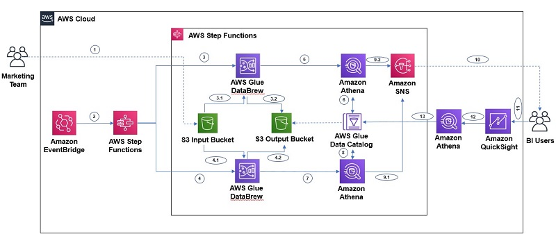
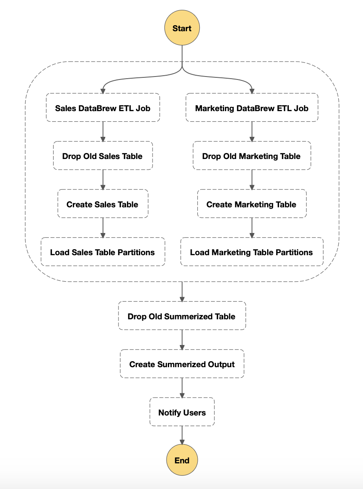

## Intro:

First off, this example has been taken from [Orchestrating an AWS Glue DataBrew job and Amazon Athena query with AWS Step Functions](https://awsfeed.com/whats-new/big-data/orchestrating-an-aws-glue-databrew-job-and-amazon-athena-query-with-aws-step-functions) blog. For a greater depth please visit original blog. This example will only go over how to create the State machine using the `R stepfunctions sdk`.

## The Build:

For this example here is the target architecture we are going replicate using `R stepfunctions sdk`.


```r
library(stepfunctions)
```

First set up the parallel stage of the workflow.

```r
parallel = Parallel$new("Refresh Sales Marketing Data")
```

As we are going to use `AWS Athena` we can set up some common outputs.

```r
athena_output = list("OutputLocation"="s3://<your-aws-athena-query-results-bucket-path>")
work_group = "primary"
```

Now will set the sales branch.

```r
# Use DataBrew to collect sales data
sale_collect = DataBrewStartJobRunStep$new("Sales DataBrew ETL Job", parameters=list("Name"="sales-data"))

# Remove existing table
sale_athena_drop = AthenaStartQueryExecutionStep$new("Drop Old Sales Table", parameters = list(
    "QueryString"="DROP TABLE IF EXISTS sales_data_output",
    "WorkGroup"=work_group,
    "ResultConfiguration"=athena_output
))

# Rebuild Athena Table
sale_athena_create = AthenaStartQueryExecutionStep$new("Create Sales Table", parameters=list(
    "QueryString"="CREATE EXTERNAL TABLE `sales_data_output`(`date` string, `salesperson` string, `lead_name` string, `segment` string, `region` string, `target_close` string, `forecasted_monthly_revenue` int, `opportunity_stage` string, `weighted_revenue` int, `closed_opportunity` boolean, `active_opportunity` boolean, `latest_status_entry` boolean) PARTITIONED BY (`year` string,`month` string, `day` string) ROW FORMAT SERDE 'org.apache.hadoop.hive.ql.io.parquet.serde.ParquetHiveSerDe' STORED AS INPUTFORMAT 'org.apache.hadoop.hive.ql.io.parquet.MapredParquetInputFormat' OUTPUTFORMAT 'org.apache.hadoop.hive.ql.io.parquet.MapredParquetOutputFormat' LOCATION 's3://<your-bucket-name>/sales-pipeline/transformed/sales/' TBLPROPERTIES ('classification'='parquet', 'compressionType'='none', 'typeOfData'='file')",
    "WorkGroup"=work_group,
    "ResultConfiguration"=athena_output
))

# Add new partiton to table
sale_athena_partition = AthenaStartQueryExecutionStep$new("Load Sales Table Partitions", parameters=list(
    "QueryString"="MSCK REPAIR TABLE sales_data_output",
    "WorkGroup"=work_group,
    "ResultConfiguration"=athena_output
))

# Chain each step together to create sales branch
sale_branch = Chain$new(c(sale_collect, sale_athena_drop, sale_athena_create, sale_athena_partition))
```

Next we will create the marketing branch.

```r
# Use DataBrew to collect marketing data
market_collect = DataBrewStartJobRunStep$new("Marketing DataBrew ETL Job", parameters=list("Name"="marketing-data-etl"))

# Remove existing table
market_athena_drop = AthenaStartQueryExecutionStep$new("Drop Old Marketing Table", parameters=list(
    "QueryString"="DROP TABLE IF EXISTS marketing_data_output",
    "WorkGroup"=work_group,
    "ResultConfiguration"=athena_output
))

# Rebuild Athena Table
market_athena_create = AthenaStartQueryExecutionStep$new("Create Marketing Table", parameters=list(
    "QueryString"="CREATE EXTERNAL TABLE `marketing_data_output`(`date` string, `new_visitors_seo` int, `new_visitors_cpc` int, `new_visitors_social_media` int, `return_visitors` int, `twitter_mentions` int, `twitter_follower_adds` int, `twitter_followers_cumulative` int, `mailing_list_adds_` int, `mailing_list_cumulative` int, `website_pageviews` int, `website_visits` int, `website_unique_visits` int, `mobile_uniques` int, `tablet_uniques` int, `desktop_uniques` int, `free_sign_up` int, `paid_conversion` int, `events` string) PARTITIONED BY (`year` string, `month` string, `day` string) ROW FORMAT SERDE 'org.apache.hadoop.hive.ql.io.parquet.serde.ParquetHiveSerDe' STORED AS INPUTFORMAT 'org.apache.hadoop.hive.ql.io.parquet.MapredParquetInputFormat' OUTPUTFORMAT 'org.apache.hadoop.hive.ql.io.parquet.MapredParquetOutputFormat' LOCATION 's3://<your-bucket-name>/sales-pipeline/transformed/marketing/' TBLPROPERTIES ('classification'='parquet', 'compressionType'='none', 'typeOfData'='file')",
    "WorkGroup"=work_group,
    "ResultConfiguration"=athena_output
))

# Add all partitions to marketing table
market_athena_partition = AthenaStartQueryExecutionStep$new("Load Marketing Table Partitions", parameters=list(
    "QueryString"="MSCK REPAIR TABLE marketing_data_output",
    "WorkGroup"=work_group,
    "ResultConfiguration"=athena_output
))

# Create marketing branch
market_branch = Chain$new(c(market_collect, market_athena_drop, market_athena_create, market_athena_partition))
```

Next we will combined the two branches in the parallel process
```r
parallel$add_branch(sale_branch)
parallel$add_branch(market_branch)
```

Next step will be to create the summary table for users to query.

```r
# Drop existing table
summary_athena_drop = AthenaStartQueryExecutionStep$new("Drop Old Summerized Table", parameter=list(
    "QueryString"="DROP TABLE default.sales_marketing_revenue",
    "WorkGroup"=work_group,
    "ResultConfiguration"=athena_output
))

# Create table
summary_athena_create = AthenaStartQueryExecutionStep$new("Create Summerized Output", parameter=list(
    "QueryString"="CREATE TABLE default.sales_marketing_revenue AS SELECT * FROM (SELECT sales.year, sales.month, total_paid_conversion, total_weighted_revenue FROM (SELECT year, month, sum(paid_conversion) as total_paid_conversion FROM default.marketing_data_output group by year, month) sales INNER JOIN (SELECT year, month, sum(weighted_revenue) as total_weighted_revenue FROM default.sales_data_output group by year, month) marketing on sales.year=marketing.year AND sales.month=marketing.month) ORDER BY year DESC, month DESC",
    "WorkGroup"=work_group,
    "ResultConfiguration"=athena_output
))

# Send notification to users
notify_users = SnsPublishStep$new("Notify Users", parameter=list(
    "Message"=list(
        "Input"="Monthly sales marketing data refreshed successfully!"),
    "TopicArn"="arn:aws:sns:us-east-1:<account-id>:<sns-topic-name>"
))

# Combine steps together
summary_chain = Chain$new(c(summary_athena_drop, summary_athena_create, notify_users))
```

Nearly there! We can now combine the parallel stage and the summary stage together.
```r
workflow_definition = Chain$new(c(parallel, summary_chain))
```

We can now create a workflow ready to send to AWS.
```r
stepfunctions_execution_role="<stepfunction execution role>"
workflow = Workflow$new(
  name="<whatever you want to call it>",
  definition=workflow_definition,
  role=stepfunctions_execution_role
)
```

To veiw the workflow graph use the method `render_graph`. **NOTE:** Jupyter notebook currently only supports graphical output.
```r
workflow$render_graph(T)
```


To view the `AWS States Language` you can use the method `to_json()`
```r
workflow$definition$to_json(T)
```

```json
{
  "StartAt": "Refresh Sales Marketing Data",
  "States": {
    "Refresh Sales Marketing Data": {
      "Type": "Parallel",
      "Next": "Drop Old Summerized Table",
      "Branches": [
        {
          "StartAt": "Sales DataBrew ETL Job",
          "States": {
            "Sales DataBrew ETL Job": {
              "Parameters": {
                "Name": "sales-data"
              },
              "Resource": "arn:aws:states:::databrew:startJobRun.sync",
              "Type": "Task",
              "Next": "Drop Old Sales Table"
            },
            "Drop Old Sales Table": {
              "Parameters": {
                "QueryString": "DROP TABLE IF EXISTS sales_data_output",
                "WorkGroup": "primary",
                "ResultConfiguration": {
                  "OutputLocation": "s3://<your-aws-athena-query-results-bucket-path>"
                }
              },
              "Resource": "arn:aws:states:::athena:startQueryExecution.sync",
              "Type": "Task",
              "Next": "Create Sales Table"
            },
            "Create Sales Table": {
              "Parameters": {
                "QueryString": "CREATE EXTERNAL TABLE `sales_data_output`(`date` string, `salesperson` string, `lead_name` string, `segment` string, `region` string, `target_close` string, `forecasted_monthly_revenue` int, `opportunity_stage` string, `weighted_revenue` int, `closed_opportunity` boolean, `active_opportunity` boolean, `latest_status_entry` boolean) PARTITIONED BY (`year` string,`month` string, `day` string) ROW FORMAT SERDE 'org.apache.hadoop.hive.ql.io.parquet.serde.ParquetHiveSerDe' STORED AS INPUTFORMAT 'org.apache.hadoop.hive.ql.io.parquet.MapredParquetInputFormat' OUTPUTFORMAT 'org.apache.hadoop.hive.ql.io.parquet.MapredParquetOutputFormat' LOCATION 's3://<your-bucket-name>/sales-pipeline/transformed/sales/' TBLPROPERTIES ('classification'='parquet', 'compressionType'='none', 'typeOfData'='file')",
                "WorkGroup": "primary",
                "ResultConfiguration": {
                  "OutputLocation": "s3://<your-aws-athena-query-results-bucket-path>"
                }
              },
              "Resource": "arn:aws:states:::athena:startQueryExecution.sync",
              "Type": "Task",
              "Next": "Load Sales Table Partitions"
            },
            "Load Sales Table Partitions": {
              "Parameters": {
                "QueryString": "MSCK REPAIR TABLE sales_data_output",
                "WorkGroup": "primary",
                "ResultConfiguration": {
                  "OutputLocation": "s3://<your-aws-athena-query-results-bucket-path>"
                }
              },
              "Resource": "arn:aws:states:::athena:startQueryExecution.sync",
              "Type": "Task",
              "End": true
            }
          }
        },
        {
          "StartAt": "Marketing DataBrew ETL Job",
          "States": {
            "Marketing DataBrew ETL Job": {
              "Parameters": {
                "Name": "marketing-data-etl"
              },
              "Resource": "arn:aws:states:::databrew:startJobRun.sync",
              "Type": "Task",
              "Next": "Drop Old Marketing Table"
            },
            "Drop Old Marketing Table": {
              "Parameters": {
                "QueryString": "DROP TABLE IF EXISTS marketing_data_output",
                "WorkGroup": "primary",
                "ResultConfiguration": {
                  "OutputLocation": "s3://<your-aws-athena-query-results-bucket-path>"
                }
              },
              "Resource": "arn:aws:states:::athena:startQueryExecution.sync",
              "Type": "Task",
              "Next": "Create Marketing Table"
            },
            "Create Marketing Table": {
              "Parameters": {
                "QueryString": "CREATE EXTERNAL TABLE `marketing_data_output`(`date` string, `new_visitors_seo` int, `new_visitors_cpc` int, `new_visitors_social_media` int, `return_visitors` int, `twitter_mentions` int, `twitter_follower_adds` int, `twitter_followers_cumulative` int, `mailing_list_adds_` int, `mailing_list_cumulative` int, `website_pageviews` int, `website_visits` int, `website_unique_visits` int, `mobile_uniques` int, `tablet_uniques` int, `desktop_uniques` int, `free_sign_up` int, `paid_conversion` int, `events` string) PARTITIONED BY (`year` string, `month` string, `day` string) ROW FORMAT SERDE 'org.apache.hadoop.hive.ql.io.parquet.serde.ParquetHiveSerDe' STORED AS INPUTFORMAT 'org.apache.hadoop.hive.ql.io.parquet.MapredParquetInputFormat' OUTPUTFORMAT 'org.apache.hadoop.hive.ql.io.parquet.MapredParquetOutputFormat' LOCATION 's3://<your-bucket-name>/sales-pipeline/transformed/marketing/' TBLPROPERTIES ('classification'='parquet', 'compressionType'='none', 'typeOfData'='file')",
                "WorkGroup": "primary",
                "ResultConfiguration": {
                  "OutputLocation": "s3://<your-aws-athena-query-results-bucket-path>"
                }
              },
              "Resource": "arn:aws:states:::athena:startQueryExecution.sync",
              "Type": "Task",
              "Next": "Load Marketing Table Partitions"
            },
            "Load Marketing Table Partitions": {
              "Parameters": {
                "QueryString": "MSCK REPAIR TABLE marketing_data_output",
                "WorkGroup": "primary",
                "ResultConfiguration": {
                  "OutputLocation": "s3://<your-aws-athena-query-results-bucket-path>"
                }
              },
              "Resource": "arn:aws:states:::athena:startQueryExecution.sync",
              "Type": "Task",
              "End": true
            }
          }
        }
      ]
    },
    "Drop Old Summerized Table": {
      "Parameters": {
        "QueryString": "DROP TABLE default.sales_marketing_revenue",
        "WorkGroup": "primary",
        "ResultConfiguration": {
          "OutputLocation": "s3://<your-aws-athena-query-results-bucket-path>"
        }
      },
      "Resource": "arn:aws:states:::athena:startQueryExecution.sync",
      "Type": "Task",
      "Next": "Create Summerized Output"
    },
    "Create Summerized Output": {
      "Parameters": {
        "QueryString": "CREATE TABLE default.sales_marketing_revenue AS SELECT * FROM (SELECT sales.year, sales.month, total_paid_conversion, total_weighted_revenue FROM (SELECT year, month, sum(paid_conversion) as total_paid_conversion FROM default.marketing_data_output group by year, month) sales INNER JOIN (SELECT year, month, sum(weighted_revenue) as total_weighted_revenue FROM default.sales_data_output group by year, month) marketing on sales.year=marketing.year AND sales.month=marketing.month) ORDER BY year DESC, month DESC",
        "WorkGroup": "primary",
        "ResultConfiguration": {
          "OutputLocation": "s3://<your-aws-athena-query-results-bucket-path>"
        }
      },
      "Resource": "arn:aws:states:::athena:startQueryExecution.sync",
      "Type": "Task",
      "Next": "Notify Users"
    },
    "Notify Users": {
      "Parameters": {
        "Message": {
          "Input": "Monthly sales marketing data refreshed successfully!"
        },
        "TopicArn": "arn:aws:sns:us-east-1:<account-id>:<sns-topic-name>"
      },
      "Resource": "arn:aws:states:::sns:publish",
      "Type": "Task",
      "End": true
    }
  }
}
```
## Sum up:

`R stepfunctions` streamlines the creation of AWS State Language and makes the processes of creating stepfunctiosn from R alot more simpler.

